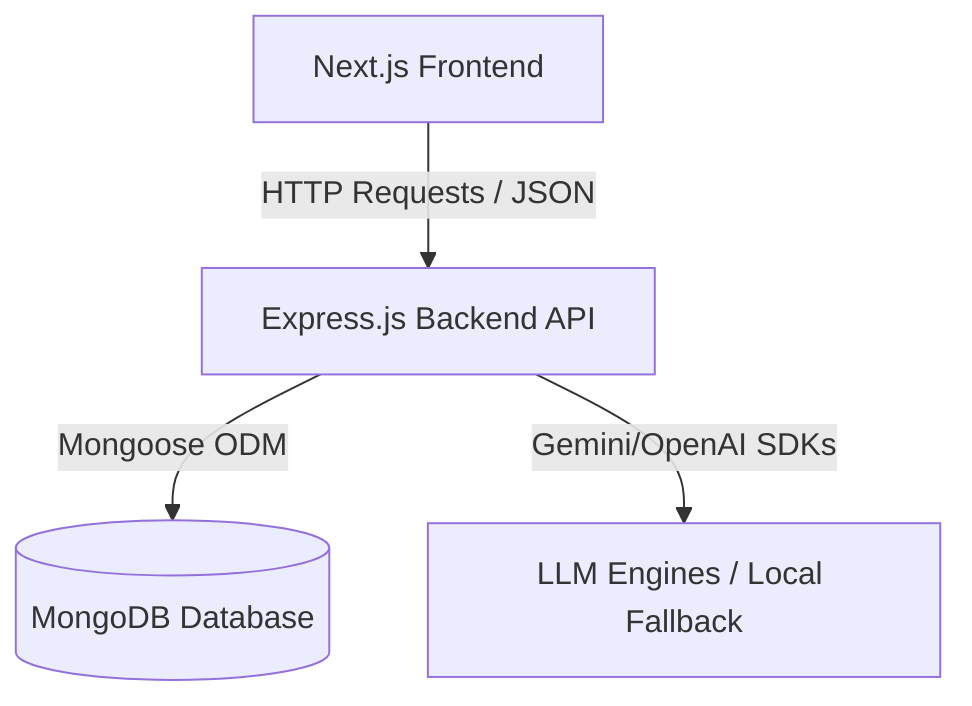
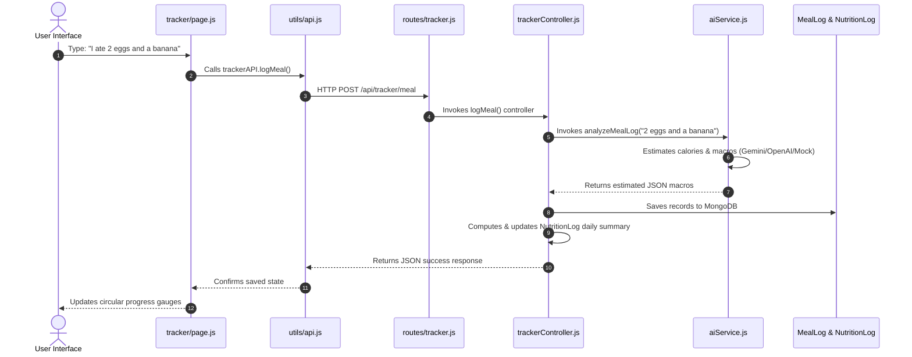

# NutriMate AI – Project Architecture & Components Guide

Welcome to the **NutriMate AI** architecture guide. This document explains the directory structure, file layout, and significance of each component in this personalized food recommendation and nutrition tracking platform.

---

## 1. High-Level Architecture Overview

NutriMate AI is built as a split **Next.js frontend** and **Node.js/Express backend**, connected to a **MongoDB database** for persistence.



*   **Frontend**: Built with Next.js App Router, Tailwind CSS, and standard React state hooks. Handled entirely via client-side routing.
*   **Backend**: Node.js/Express API that exposes REST endpoints for user authentication, pantry management, meal tracking, and planner logic.
*   **AI Integration**: Centralized on the backend to avoid leaking API keys to client browsers. If no API keys are configured, it falls back to a rules-based local engine.

---

## 2. Directory Layout & Significance

### 📂 Backend Codebase (`/backend`)

The backend codebase is organized as follows:

```
backend/
├── config/              # Database configurations
├── controllers/         # Logic handlers for endpoints
├── middleware/          # Security and authorization filters
├── models/              # Mongoose schemas for MongoDB collection mappings
├── routes/              # Express route definitions mapping URLs to controllers
├── services/            # Custom service engines (AI logic / fallbacks)
├── server.js            # Entrypoint that mounts middleware and boots port 5000
└── .env                 # Environment variables (port, db connection, API keys)
```

#### 📄 Configuration
*   [**`config/db.js`**](file:///c:/Users/Asus/OneDrive/Desktop/FoodChatbot/backend/config/db.js): Sets up Mongoose and manages database connections to the local MongoDB service.

#### 📄 Models (Database Schemas)
*   [**`models/User.js`**](file:///c:/Users/Asus/OneDrive/Desktop/FoodChatbot/backend/models/User.js): Holds credential records (Name, Email, salted/hashed passwords) for user authentication.
*   [**`models/UserProfile.js`**](file:///c:/Users/Asus/OneDrive/Desktop/FoodChatbot/backend/models/UserProfile.js): Stores personal metrics (Age, Gender, Weight, Height, Activity level, Health goal, Custom AI API keys) to dynamically compute personal daily nutrition targets.
*   [**`models/PantryItem.js`**](file:///c:/Users/Asus/OneDrive/Desktop/FoodChatbot/backend/models/PantryItem.js): Tracks ingredients currently in the user's fridge/pantry, including quantities, units, and expiry alerts.
*   [**`models/MealLog.js`**](file:///c:/Users/Asus/OneDrive/Desktop/FoodChatbot/backend/models/MealLog.js): Records individual food logs categorized by meal types (Breakfast, Lunch, Dinner, Snack) with calorie and macronutrient details.
*   [**`models/NutritionLog.js`**](file:///c:/Users/Asus/OneDrive/Desktop/FoodChatbot/backend/models/NutritionLog.js): Serves as a daily rollup that aggregates water intake and total daily calories/macros for analytics.
*   [**`models/ChatHistory.js`**](file:///c:/Users/Asus/OneDrive/Desktop/FoodChatbot/backend/models/ChatHistory.js): Saves user conversation histories with the chatbot to maintain conversational memory across sessions.

#### 📄 Controllers (Logic Handlers)
*   [**`controllers/authController.js`**](file:///c:/Users/Asus/OneDrive/Desktop/FoodChatbot/backend/controllers/authController.js): Coordinates registrations and logins, returns signed JWT access tokens.
*   [**`controllers/profileController.js`**](file:///c:/Users/Asus/OneDrive/Desktop/FoodChatbot/backend/controllers/profileController.js): Implements Mifflin-St Jeor formulas to auto-calculate BMR, TDEE, calorie caps, and macronutrient targets based on user demographics.
*   [**`controllers/pantryController.js`**](file:///c:/Users/Asus/OneDrive/Desktop/FoodChatbot/backend/controllers/pantryController.js): Implements CRUD for pantry inventory and retrieves expiring ingredients.
*   [**`controllers/trackerController.js`**](file:///c:/Users/Asus/OneDrive/Desktop/FoodChatbot/backend/controllers/trackerController.js): Manages food logs, water updates, daily aggregates, and history retrieval.
*   [**`controllers/plannerController.js`**](file:///c:/Users/Asus/OneDrive/Desktop/FoodChatbot/backend/controllers/plannerController.js): Generates weekly plans and grocery shopping checklists based on pantry contents.
*   [**`controllers/chatController.js`**](file:///c:/Users/Asus/OneDrive/Desktop/FoodChatbot/backend/controllers/chatController.js): Retrieves message threads and feeds conversation memory blocks into the AI model.

#### 📄 Routes & Middleware
*   [**`middleware/auth.js`**](file:///c:/Users/Asus/OneDrive/Desktop/FoodChatbot/backend/middleware/auth.js): Restricts endpoints, extracts JWT tokens from authorization headers, and adds user credentials to request contexts.
*   **`routes/`**: Directly maps standard HTTP actions to corresponding controller triggers (e.g. `POST /api/tracker/meal` triggers `trackerController.logMeal`).

#### 📄 AI Integration
*   [**`services/aiService.js`**](file:///c:/Users/Asus/OneDrive/Desktop/FoodChatbot/backend/services/aiService.js): The central intelligence file that instantiates OpenAI/Gemini SDKs, handles custom context mapping, and operates a comprehensive local mock fallback engine for when API keys are absent.

---

### 📂 Frontend Codebase (`/frontend`)

The Next.js frontend codebase follows the Next.js App Router structure:

```
frontend/
├── public/              # Static media assets & local font files
│   └── fonts/           # Local Virgil font storage (Virgil.woff2)
└── src/
    ├── app/             # App Router pages and global layouts
    ├── components/      # Shared components (Layout frames, Sidebars)
    ├── context/         # React Context providers (Auth session state)
    └── utils/           # API fetch wrappers and authentication token helpers
```

#### 📄 Layout & Styles
*   [**`app/layout.js`**](file:///c:/Users/Asus/OneDrive/Desktop/FoodChatbot/frontend/src/app/layout.js): The root wrapper for all pages. Handles loading global CSS and rendering global context wrappers.
*   [**`app/globals.css`**](file:///c:/Users/Asus/OneDrive/Desktop/FoodChatbot/frontend/src/app/globals.css): Declares tailwind utilities, imports the local Virgil handwriting font, maps it to Tailwind v4 fonts (`--font-sans`), and applies card-shadow styling guidelines.
*   [**`components/LayoutFrame.js`**](file:///c:/Users/Asus/OneDrive/Desktop/FoodChatbot/frontend/src/components/LayoutFrame.js): Renders the main dashboard layout frame, responsive mobile sidebar drawer, goal indicator headers, and user profile feet.

#### 📄 Core Logic & State Providers
*   [**`context/AuthContext.js`**](file:///c:/Users/Asus/OneDrive/Desktop/FoodChatbot/frontend/src/context/AuthContext.js): Keeps user registration/login statuses globally accessible across pages, automatically stores/reads JWT keys from local storage, and manages private routes.
*   [**`utils/api.js`**](file:///c:/Users/Asus/OneDrive/Desktop/FoodChatbot/frontend/src/utils/api.js): Sets up fetch call headers, resolves local storage authorization tokens, and wraps all endpoint requests under simple objects (`authAPI`, `profileAPI`, `pantryAPI`, `trackerAPI`, `chatAPI`, `plannerAPI`).

#### 📄 App Pages
*   [**`app/page.js` (Dashboard)**](file:///c:/Users/Asus/OneDrive/Desktop/FoodChatbot/frontend/src/app/page.js): Displays calorie ring graphs, macro meters, water triggers, expiry indicators, and weekly progress charts.
*   [**`app/onboarding/page.js` (Onboarding)**](file:///c:/Users/Asus/OneDrive/Desktop/FoodChatbot/frontend/src/app/onboarding/page.js): Collects baseline demographics (age, height, weight, activity, goals) for newly registered accounts.
*   [**`app/pantry/page.js` (Pantry Management)**](file:///c:/Users/Asus/OneDrive/Desktop/FoodChatbot/frontend/src/app/pantry/page.js): Inventory listing allowing additions, edits, deletions, and warning badges for short-shelf-life ingredients.
*   [**`app/tracker/page.js` (Meal Tracker)**](file:///c:/Users/Asus/OneDrive/Desktop/FoodChatbot/frontend/src/app/tracker/page.js): The central area for entering meal entries using either AI natural language estimation or manual macro values.
*   [**`app/chat/page.js` (AI Chatbot)**](file:///c:/Users/Asus/OneDrive/Desktop/FoodChatbot/frontend/src/app/chat/page.js): Chat portal displaying memory logs (calorie budgets, current pantry stocks) alongside the message thread.
*   [**`app/planner/page.js` (Meal Planner)**](file:///c:/Users/Asus/OneDrive/Desktop/FoodChatbot/frontend/src/app/planner/page.js): Generates customized 7-day schedules and constructs missing-ingredient shopping lists.
*   [**`app/history/page.js` (Meal History)**](file:///c:/Users/Asus/OneDrive/Desktop/FoodChatbot/frontend/src/app/history/page.js): Houses historical records of calories logged and allows deleting past entries.
*   [**`app/settings/page.js` (Settings)**](file:///c:/Users/Asus/OneDrive/Desktop/FoodChatbot/frontend/src/app/settings/page.js): Allows updating user parameters, dietary guidelines, preferred cuisines, or entering customized OpenAI/Gemini credentials.

---

## 3. Data Flow Example: Natural Language Food Logging

This sequence diagram details how your inputs flow through the application files during a typical food logging action:


